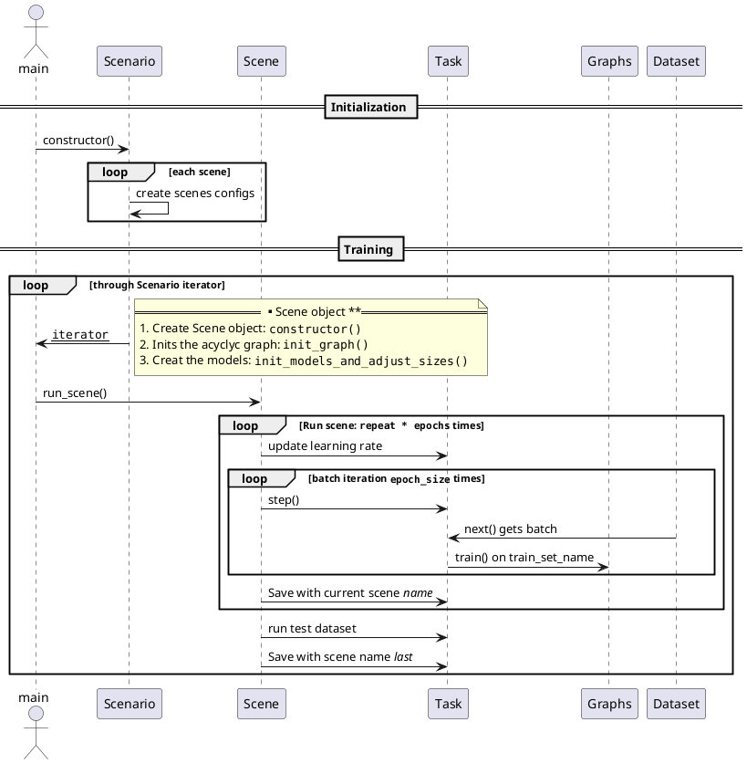

# DeepMed

This software is designed to learn the causality/correlation between different modalities of medical data.
These modalities include Numbers, signals with 1D consistency like language or ECG, signals with 2D consistency like images or activation maps and signals with 3D consistency like videos or MRI.

## Installation

This software is written in python language version 3.6 & 3.7
See the `requirements.txt` for a package dump. To insall you can use `conda install --file requirements.txt`
or install manually the following packages:

[pandas:](https://pandas.pydata.org/) for handling dataframes and CSVs.

`pip install pandas --user`

[scikit-image:](http://scikit-image.org/) for image operations

`pip install scikit-image --user`

[opencv:](https://opencv.org/) for image operations

`pip install opencv-python --user`

At the moment, we use [_pytorch_](https://pytorch.org/) back-end for our neural network operations

## Important structures

The main objective of this software is automatically to create a _Graph_ between different modalities defined in _Datasets_, update the parameters of the _Graph_ based on the samples in the _Dataset_ and evaluate the results (training).

## Sequence for calling train

## Tests

In the `tests` folder you will find component tests. You can run all of them using `nose2` (install `conda install -y nose2`)
