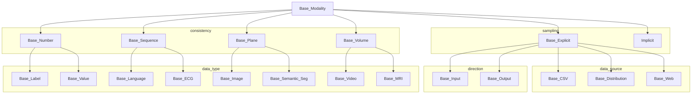

# Modalities

A data point is a collection of information. This information is stored in different modalities.
There are causations or correlations between different modalities of each data point
The process of learning is to find a mapping between these modalities through a pre-defined graph.
Modalities are the nodes in the aforementioned graph. (See more about graphs here)

## Consistency of modalities

We treat modalities differently based on their consistencies

- **Numbers** generally have no spatio-temporal consistencies. They can be divided into the following categories. The dimension of these modality is `[num_channels]`.
  - **labels** are integer numbers
    - **One vs Rest** labels are non-negative Monotonically increasing numbers each representing a single class. If a class label for a data point is `-100`, that means we will ignore this data point. For this class the number of `num_channels` is equal to the `num_classes`
    - **Bipolar** labels are integer values. Usually, +1 represents a positive class and -1 represents the negative class. 0 could be used as boundary values. For this class the number of `num_channels` is equal to the `1`
    - **Multi_Bipolar** same as above but has the ability to simultaneously handle multiple bipolar outputs.
  - **values** are continues values
    - **Bounding box** is a list of `5` continues values indicating `5` degrees of freedom a rectangle could have. For this class the number of `num_channels` is equal to the `5`
    - **Date** is the time the data point is created. It is useful to have them as the age of the patient, or the time between two exams.
- **Sequences** these modalities have _1D_ (temporal) consistencies. The dimension of these modality is `[num_channels x width]`.
  - **Sentences** and _translation_ and _descriptions_ are in this category
  - **ECG** one single lead is one channel, i.e. genarating 6 channels for the the V1-6 chest leads.
- **Planes** these modalities have _2D_ (spatial) consistencies one way or the other. The dimension of these modality is `[num_channels x height x width]`.

  - **Normal images** are in this category. They can be loaded from .jpg files, .png files, etc.
  - **Semantic segmentations** are also in this category
  - **Dicom images** are like normal images but they need special libraries to be loaded

- **Volumes** Any data with spatio-temporal consistency or another form of _3D_ consistencies. The dimension of these modality is `[num_channels x depth x height x width]`.
  - **MIR** images are in this category

we can access the dimensionality of a modality with `get_consistency()`, `get_channels()`, `get_width()`, `get_height()` and `get_depth()`

### Examples

A concistency for an ImageNet image is $R^(224x224x3)$, i.e. it has the structure of a 3D tensor, that allows for convolutions. A number with 224x224x3 lacks
this structure and convolutions would make no sense although the number of elements and the size of the tensor is the same, e.g. blood sample.

## Explicit/Implicit modalities:

Modalities could be explicit or implicit. _Explicit_ modalities are modalities where we know how the information in this modality look like. For example, they are an image or a sentence or a label. Because of this, we can sample from explicit modalities. This can also be viewed as _explicit_ being leaf in the graph (either top or bottom) and _implicit_ is any node in the middle (internal).

_Implicit_ modalities on the other hand, are not exactly constrained by the sample and the data distribution in these modalities changes during the training. Also, we cannot sample from _implicit_ modalities.

The most important function _explicit_ modalities must implement is `get_item(index)`. _Explicit_ Modality implements `get_batch(self,batch)` that uses `get_item` and puts `items` into a `batch`.

`is_implicit_modality()` and `is_explicit_modality()` could help us determine the sampling properties of a modality.

### Data source

_Explicit_ modalities could be accessed in different ways:

- _from CSV tables_: These types of modalities are generally small (like labels) and can fit into the CSV file
- _from distributions_ These modalities do not carry any fixed information but rather sampled from a known distribution. For example, GANs and AEs employ modalities sampled from a known Gaussian distribution
- _from web_ These modalities contain the instructions necessary to download the samples from the web. This abstract modality is not implemented yet, but it will be the connection between the core and the Web UI in the future.

_Explicit_ modalities should also generate a config object an implicit modality: `get_implicit_modality_cfgs(self)`, and another config object `get_default_model_cfgs` that connects current _explicit_ modality to it's _implicit_ modality. The main idea behind assigning _explicit_ modality to each _implicit_ modality is that we can add independency to the graph structure. For example, the first few layers of a network trained on `Imagenet` won't be useful for inference for `xray` dataset but the middle layers are. By defining a new modality : `implicit_image` we could reuse any parameter that comes after the _implicit_ modality while preserving parameters that map `image` to `implicit_image` unique for each task.

### Direction of modalities

_Explicit_ modalities could also be divided into **input** modalities and **output** modalities.

**input** modalities could be seen as the 'cause' and **output** modalities and the 'effect'.

we can access the direction of modality with `is_input_modality()` and `is_output_modality()` functions

