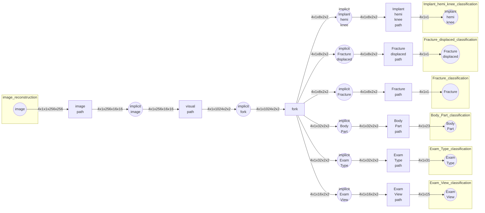

# Graph

**Graph** is an abstract object that maps the relationship between the input and output modalities. the most simple form of graph could be just a deep convolution network mapping the input to the output

## Model

**Model** is an object that maps two **modalities** together.
A **Model** must have the following objects:

1. `encoder` and `decoder` are the `neural_nets` that does the mapping
2. `heads` and `tails` are the head and tail **modalities**
3. `factory` is a factory that create singleton `encoder` and `decoder`. The reason that these neural netowrks are signleton is that we want to make sure that different graphs and tasks share the same mappings between modalities. (for example, during the train and test, we should have the same neural networks do the mappings)

**Model** also has the following functions:

1. `__init__` initializes the model based on `model_cfgs`, `graph_cfgs`, `scene_cfgs` and `scenario_cfgs`.
2. `encode(batch)` and `decode(batch)` forwards the `batch` into `encoder` and `decoder` neural networks, which in turn, calculate the results and put it back in the `batch`. `batch` is a dictionary that stores all the modality `tensors`, `loss` values, `results` and `times` in it.
3. `update_modality_dims()` is an important function that automatically calculate the dimensions of the modalities if they are not specified in other config files. The reason that we calculate the modality dimension on the fly is that this way, we can dynamically make the graph and don't be bothered with the input,output sizes of tensors.
4. `step()`, `zero_grad()`, `update_learning_rate(learning_rate)`, `train()` and `eval()` are calling the same functionalities in the `encoder` and `decoder` neural networks, if they exists.

## Factories

**Factory** is a _singleton_ object that generates neural networks.
There are multiple categories of factories:

1. **Cascade_factory** is responsible for generating cascades of neural networks.
